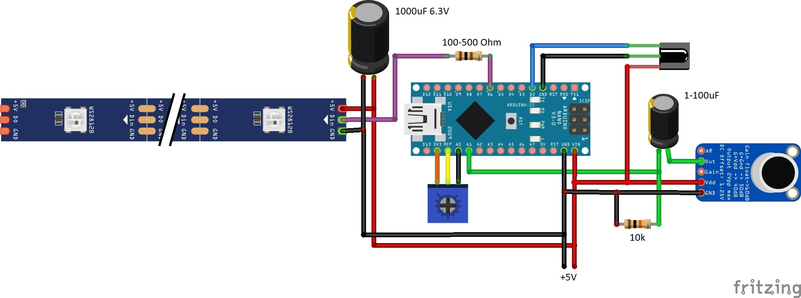
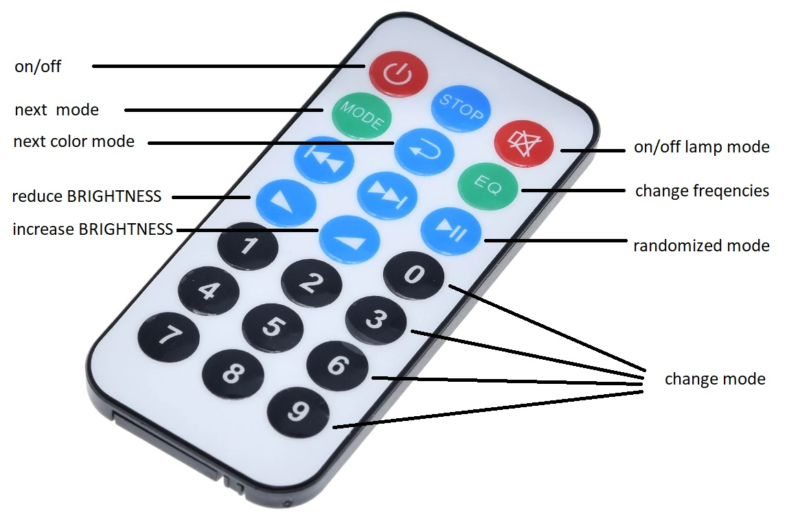
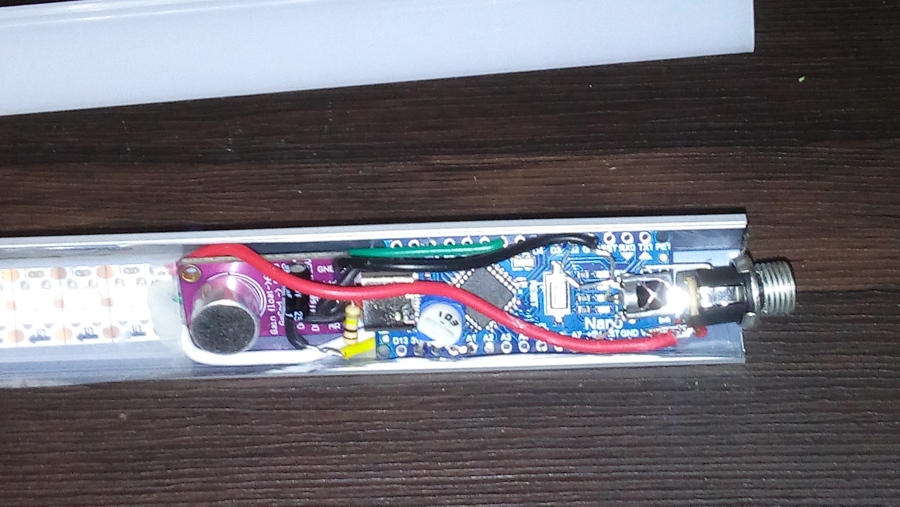
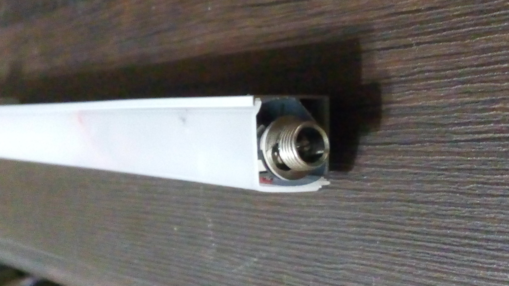

# Lumazoid IR RC

Firmware for the alternative realtime music visualizer board inspired by Lumazoid from nootropic design.
Changes from the original Lumazoid project are:
- input from microphone module MAX9814 (to A1)
- IR remote control is added
- number of LEDs is variable and may be any (200 is max, due to Nano V3.0 memory limit)
- all buttons and potentiometers are removed (IR RC is the only control)
- new visualization modes were added
- bands were mixed to get all Low, Middle and High bands even on small set of frequencies bands
- Lamp mode (with ajustable brightness)





Color modes:
- Randomized color
- Cycle color change
- Band's base color + fractional part
- Pure Band's base color

Visualization modes:
- Dance party (dots move from center to sides)
- Dance party mirrored (dots move from sides to center)
- Dance party single side (dots move from left to right)
- Dance party single side mirrored (dots move from right to left)
- Pulse (pulsation from center)
- Light bar (whole strip blinking, stroboscope)
- Color bars (multiple bars of fixed width)
- Color bars 2 (multiple bars of variable width)
- Color bars 3 (several bars of variable width, wider than previous)
- Flashbulbs (flashing dots)
- Fireflies (moving dots)
- Mirage (bars in fixed positions, one for each band)
- Mirage mirrored (bars in fixed positions, mirrored, two for each band)

Install libraries/ffft in your Arduino sketchbook libraries folder.

Requires:
- [Adafruit NeoPixel library](https://github.com/adafruit/Adafruit_NeoPixel).
- [IRLremote](https://github.com/NicoHood/IRLremote)

Your directory structure should look like this:

```
your_sketchbook
 |
 +--libraries
 |   |
 |   +--ffft
 |   |
 |   +--Adafruit_NeoPixel
 |   |
 |   +--IRLremote
 |
 +--Lumazoid
     |
     +--Lumazoid.h
     +--Lumazoid.ino
```

In the Arduino IDE, select board type "Arduino Nano" to upload to the Lumazoid.



