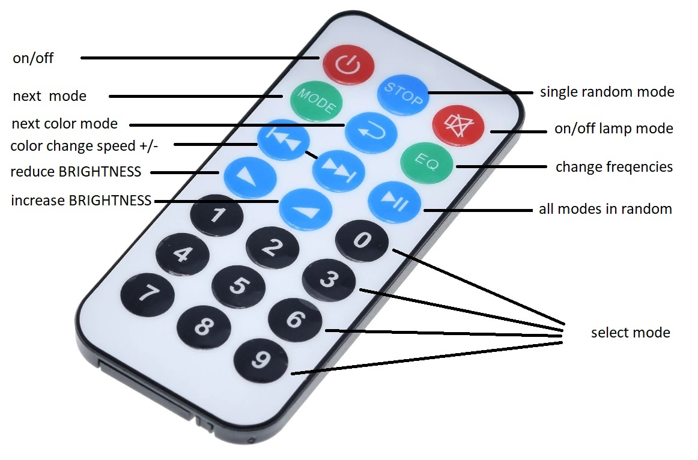
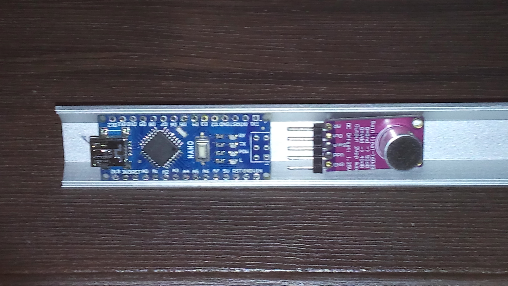

# Lumazoid IR RC

Firmware for the alternative Lumazoid realtime music visualizer board from nootropic design.
Changes from the original Lumazoid project are:
- input from microphone module MAX9814 (to A1)
- IR remote control is added
- number of LEDs is variable and may be any (210 is max due to Nano V3.0 memory limit)
- all buttons and potentiometers are removed (IR RC is the only)
- new modes were added
- Lamp mode (with ajustable brightness)




Color modes:
- Randomized color
- Cycle color change
- Band base color + fractional part
- Pure Band color

Install libraries/ffft in your Arduino sketchbook libraries folder.

Requires:
- [Adafruit NeoPixel library](https://github.com/adafruit/Adafruit_NeoPixel).
- [IRLremote](https://github.com/NicoHood/IRLremote)

Your directory structure should look like this:

```
your_sketchbook
 |
 +--libraries
 |   |
 |   +--ffft
 |   |
 |   +--Adafruit_NeoPixel
 |   |
 |   +--IRLremote
 |
 +--Lumazoid
     |
     +--Lumazoid.h
     +--Lumazoid.ino
```

In the Arduino IDE, select board type "Arduino Nano" to upload to the Lumazoid.



